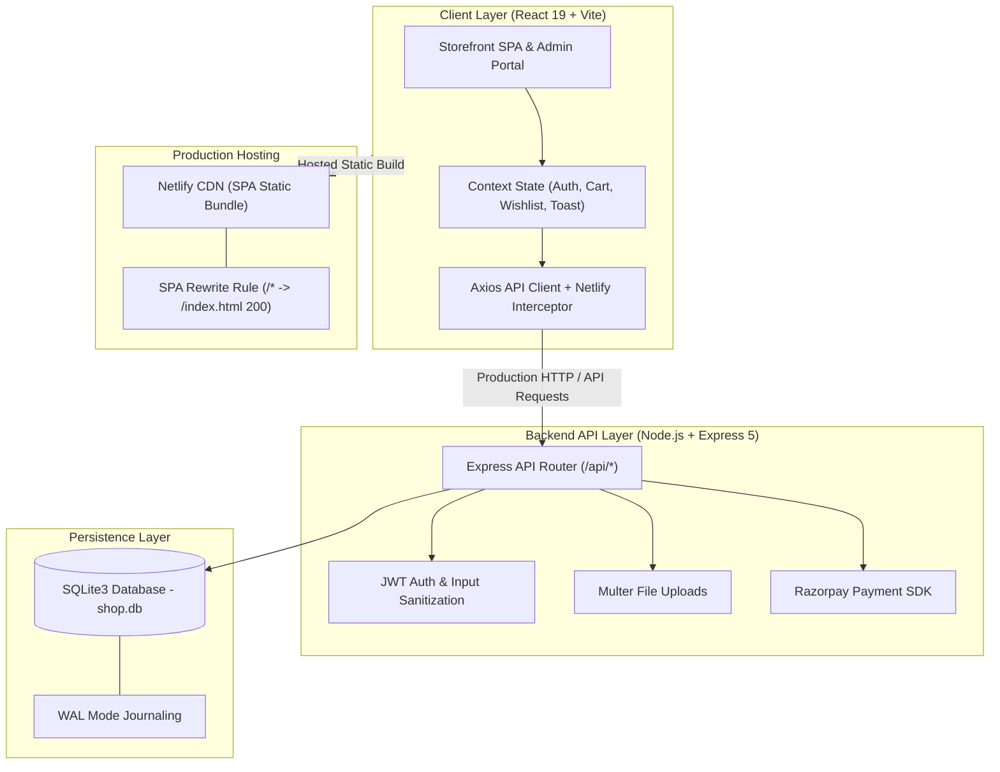

# 🛍️ ShopIndia — Full-Stack E-Commerce Application

[](https://react.dev/)
[](https://vitejs.dev/)
[](https://expressjs.com/)
[](https://www.sqlite.org/)
[](https://www.netlify.com/)

A modern, high-performance E-Commerce platform tailored for Indian fashion & apparel retail. Built with a sleek React 19 single-page application (SPA), an Express backend API with SQLite database, and pre-configured deployment rules for **Netlify**.

---

## ✨ Key Features

- **🎨 Modern UI & Micro-interactions**:
  - Smooth scale elevation and tilt zoom on product card hover.
  - Tactile press feedback (`:active` touch scaling) for mobile app feel.
  - Entrance fade-and-slide page route transitions.
  - Multi-tone skeleton shimmer loaders & button inline loading spinners.
- **🛒 Complete Shopping Experience**:
  - Instant live autocomplete product search.
  - Quick View modal overlay for seamless product inspection.
  - Size pills selector & Wishlist toggle with badge pop notifications.
  - Cart item steppers & dynamic free-shipping progress indicators.
  - Secure Razorpay Payment Gateway integration + Cash on Delivery (COD).
- **🔒 Account & Order Management**:
  - Customer authentication (Sign In / Register / Password Reset).
  - My Orders history and order tracking page.
  - Automated PDF tax invoice / receipt downloader.
- **⚡ Admin Control Panel**:
  - Product catalog management with multi-image support.
  - Order status tracking & updates.
  - Custom pages manager & store settings customization.
- **🚀 Netlify Ready**:
  - Netlify build configuration (`netlify.toml` + `_redirects` SPA rewrite rules).
  - Graceful mock fallback interceptor for static Netlify hosting previews.

---

## 🏗️ Architecture Diagram



---

## 🛠️ Tech Stack

- **Frontend**: React 19, React Router v7, Axios, TipTap Editor, Vite 8, CSS3 Custom Properties
- **Backend**: Node.js, Express 5, JSONWebToken (JWT), BcryptJS, Express Validator, PDFKit
- **Database**: SQLite3 (`better-sqlite3` with WAL mode)
- **Payments**: Razorpay Node SDK & Frontend Checkout JS
- **Deployment**: Netlify (`netlify.toml`, `_redirects`)

---

## 📁 Directory Structure

```
E-commerce/
├── netlify.toml                # Root Netlify deployment configuration
└── Shop/
    ├── client/                 # React 19 SPA (Vite)
    │   ├── netlify.toml        # Client Netlify config
    │   ├── public/
    │   │   └── _redirects      # SPA 200 redirect rule for Netlify
    │   └── src/
    │       ├── components/     # Storefront & Admin Layouts, QuickView Modal, ProductImage
    │       ├── context/        # Auth, Cart, Wishlist, Settings, Toast Contexts
    │       ├── pages/          # Storefront & Admin page views
    │       ├── services/       # Axios API client & static fallback interceptor
    │       └── index.css       # Complete design system & animation suite
    └── server/                 # Express 5 REST API
        ├── db/                 # SQLite database connection & schema seeder
        ├── middleware/         # Auth, Upload, Sanitization middlewares
        └── routes/             # Auth, Products, Categories, Orders, Settings APIs
```

---

## 🚀 Quick Start (Local Setup)

### Prerequisites
- [Node.js](https://nodejs.org/) (v18 or higher)
- npm (v9 or higher)

### 1. Clone & Install Dependencies
```bash
git clone https://github.com/thenikhilbisht/E-commerce-.git
cd E-commerce-/Shop
npm run install:all
```

### 2. Run Development Server
```bash
npm run dev
```
This runs both the backend server and frontend client concurrently:
- **Frontend App**: `http://localhost:5173/`
- **Backend API**: `http://localhost:5000/`
- **Admin Dashboard**: `http://localhost:5173/admin/login`

---

## ☁️ Deploying to Netlify

### Method A: Connect Repository (Recommended)
1. Push your repository to GitHub.
2. Log in to [Netlify](https://www.netlify.com/) and click **Add new site** → **Import an existing project**.
3. Select **GitHub** and pick your `E-commerce-` repository.
4. Netlify automatically detects `netlify.toml` settings:
   - **Base Directory**: `Shop/client`
   - **Build Command**: `npm run build`
   - **Publish Directory**: `dist`
5. Click **Deploy Site**.

### Method B: Netlify CLI
```bash
cd Shop/client
npm run build
npx netlify-cli deploy --prod --dir=dist
```

---

## 📝 License

Distributed under the MIT License. See `LICENSE` for more information.

Developed with 💎 precision by [Nikhil Bisht](https://github.com/thenikhilbisht).
